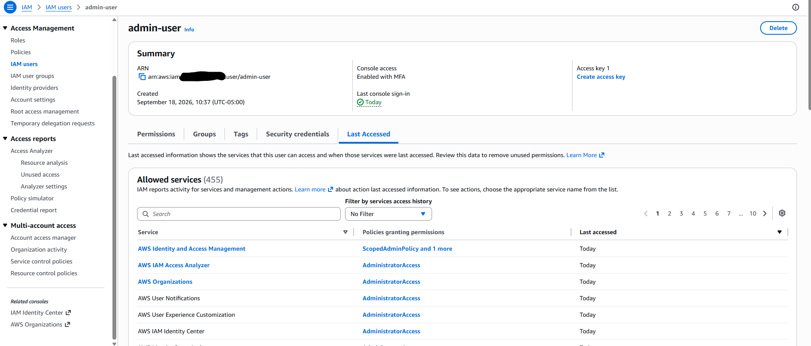
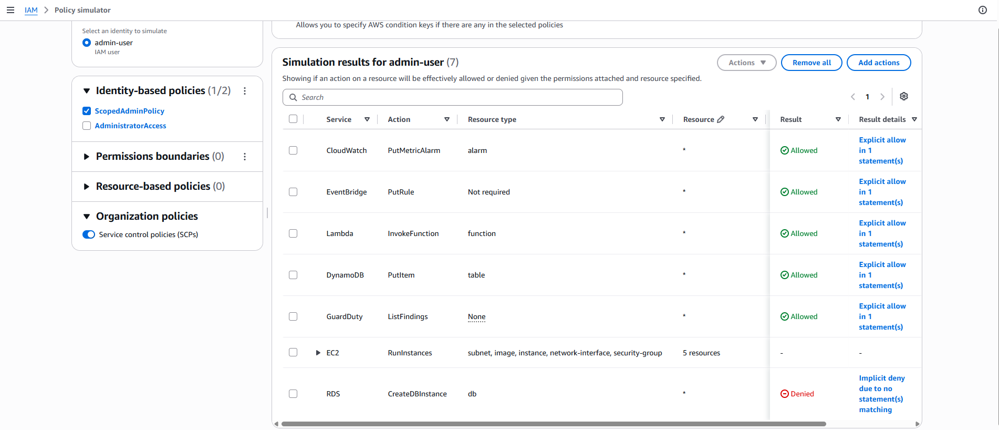
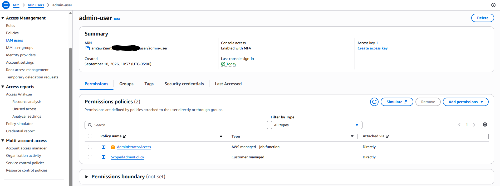
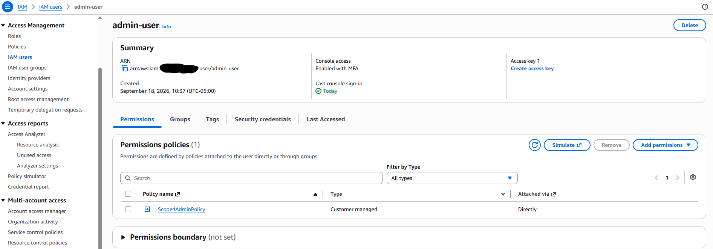
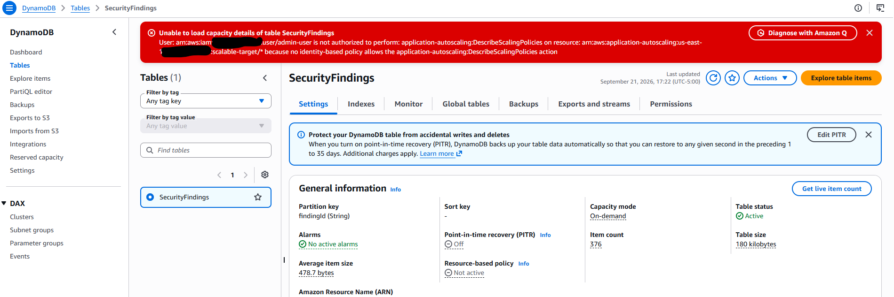

# IAM Security Assessment & Least-Privilege Remediation

## Objective

Performed a security assessment of an existing, actively-used IAM identity in my own AWS account (`admin-user`, the working account used throughout prior labs) to identify over-permissioned access, then remediated it by replacing a broad managed policy with a custom, scoped policy — verified safely, without risking loss of access, before making the change permanent. Unlike Labs 1 and 2 (real-time detection/alerting pipelines), this lab focuses on point-in-time assessment and remediation, a distinct and complementary security skill.

## Why a Real Account Instead of a Staged Example

Rather than deliberately creating an artificial over-permissioned test role, I assessed `admin-user` — the account I have genuinely been using to build Labs 1 and 2. This account had `AdministratorAccess` attached from the start (a common real-world pattern for a personal/admin working account), giving a authentic, non-staged finding to investigate and fix.

## Approach & Tools

- **IAM Access Advisor** (per-user "Last Accessed" tab) — used to get real, concrete data on which of the 455 services `AdministratorAccess` grants were actually exercised by this account.
- **IAM Policy Simulator** — used to safely test a proposed replacement policy against real actions *before* touching the account's actual permissions, eliminating the risk of a lockout.
- **IAM Access Analyzer (Unused Access analysis)** — reviewed as a complementary automated tool; noted that it is provisioned automatically by Security Hub and requires a tracking-period observation window (default 90 days) before producing mature findings, which made it less immediately useful for a young lab account compared to Access Advisor's real-time last-accessed data.

## Assessment: What I Found

Using Access Advisor, `admin-user` was shown to have **455 allowed services** via `AdministratorAccess`, of which only **approximately 50 had ever actually been accessed** — meaning roughly **88–90% of granted access had never been used** across all activity to date (spanning Labs 1 and 2: CloudTrail, CloudWatch, EventBridge, SNS, IAM, GuardDuty, Security Hub, Lambda, and DynamoDB work).



Notably, the raw "accessed" list itself required manual review rather than being used as-is: it included services touched only incidentally through AWS Console navigation (e.g., "AWS User Notifications," "AWS Free Tier," "AWS User Experience Customization") rather than through deliberate lab work. I curated the final scope down to the services genuinely used for building the labs' infrastructure, rather than blindly copying every "accessed" entry.

## Remediation

### Scoping Decision: Service-Level, Not Action-Level

I chose to scope the replacement policy at the **service level** (full access within a defined set of services, none outside it) rather than attempting full action-level least privilege (e.g., restricting to individual API calls like `dynamodb:PutItem` within each service). This was a deliberate trade-off: action-level restriction across 11 different services would be significantly more time-intensive to map correctly and risks breaking legitimate ongoing admin work (this account is still actively used to build Labs 3 and 4), whereas service-level scoping already eliminates roughly 90% of the account's unused attack surface with a much lower risk of self-inflicted breakage. This contrasts intentionally with the Lambda execution role built in Lab 2, which — as a single-purpose automation identity rather than a working admin account — was scoped to one specific action (`dynamodb:PutItem`) on one specific resource, since that level of restriction was appropriate and low-risk for that use case.

### Custom Policy (`ScopedAdminPolicy`)

Built a custom managed policy granting full access to only the services genuinely used across prior lab work:

```json
{
  "Version": "2012-10-17",
  "Statement": [
    {
      "Sid": "ScopedAdminAccess",
      "Effect": "Allow",
      "Action": [
        "cloudtrail:*",
        "logs:*",
        "cloudwatch:*",
        "events:*",
        "sns:*",
        "iam:*",
        "guardduty:*",
        "securityhub:*",
        "lambda:*",
        "dynamodb:*",
        "s3:*",
        "sts:*"
      ],
      "Resource": "*"
    }
  ]
}
```

### Safe Rollout Process

To avoid any risk of losing access to my own working account, I followed a deliberate, verify-before-cutover sequence rather than directly swapping policies:

1. Created `ScopedAdminPolicy` as a new, standalone managed policy (not yet attached to anything).
2. **Attached it alongside the existing `AdministratorAccess`** on `admin-user` — at this point, nothing about actual access had changed, since the broader policy still governed.
3. Used **IAM Policy Simulator** to test a representative set of real actions (`cloudwatch:PutMetricFilter`, `events:PutRule`, `lambda:InvokeFunction`, `dynamodb:PutItem`, `guardduty:ListFindings`) against `ScopedAdminPolicy` in isolation, confirming each was allowed — and confirmed out-of-scope actions (`ec2:RunInstances`, `rds:CreateDBInstance`) were correctly denied, as a sanity check that the policy wasn't accidentally still permissive.



4. Only after confirming the scoped policy worked in simulation did I **detach `AdministratorAccess`**, leaving `ScopedAdminPolicy` as the sole policy on the account.





## Testing & Verification

After removing `AdministratorAccess`, I performed real (not simulated) usage checks across the console to confirm the scoped policy held up in practice:

- **EventBridge** — rules list loaded and functioned normally.
- **CloudWatch** — Logs and metric filters loaded and functioned normally.
- **DynamoDB** — table data (settings, item count, table size) loaded correctly. However, the console displayed a permission error attempting to load capacity auto-scaling details, requiring `application-autoscaling:DescribeScalingPolicies` — a permission from a different service namespace than `dynamodb:*`, which was not included in the scoped policy.



### A Deliberate Accepted Gap

Rather than reflexively widening the policy to silence this warning, I investigated why it occurred and made a deliberate decision to leave it unresolved. The `SecurityFindings` table (built in Lab 2) uses **on-demand capacity mode**, which does not use auto-scaling policies at all — the console's capacity-details widget attempts to check for scaling policies regardless of capacity mode, meaning this permission gap has **zero practical effect** on actual functionality. I chose to document this as an accepted, low-risk gap rather than add `application-autoscaling:*` permissions that would never actually be exercised, in keeping with the goal of minimizing unused granted access rather than eliminating every console warning.

## Key Findings

- **A large, real gap between granted and used permissions is common and easy to miss** without deliberately checking — 88–90% of this account's granted service access had never been exercised, despite the account being in daily active use for real project work.
- **Access Advisor's "accessed" list requires human judgment, not blind trust** — it includes incidental console-navigation activity, not just deliberate infrastructure work, so a real remediation requires curating the list rather than copying it wholesale.
- **Some AWS console pages call multiple service APIs behind the scenes** to fully render (e.g., DynamoDB's table page also calling Application Auto Scaling), meaning a policy scoped to the "obvious" service for a page may still trigger incomplete console rendering — worth checking real usage, not just simulated actions, before considering remediation complete.
- **Service-level least privilege is a reasonable, defensible middle ground** for an actively-used working/admin account, distinct from the stricter action-level scoping appropriate for single-purpose automation identities (as in Lab 2's Lambda role).
- **IAM Access Analyzer's unused-access findings depend on an observation/tracking period** and may not produce mature findings for a young account — Access Advisor's real-time last-accessed data was a more immediately useful tool for this assessment.

## What I'd Add Next

- Revisit this assessment periodically (e.g., after completing Lab 4) to see whether the scoped policy needs adjustment as new services (like EC2 and VPC, for the Terraform lab) come into legitimate use — and formally add them via the same verify-before-cutover process rather than reverting to a broad policy.
- Explore narrowing selected high-privilege services (particularly `iam:*`) to action-level scoping, since IAM itself is a sensitive service where overly broad self-management permissions carry outsized risk even within an otherwise well-scoped policy.
- Return to IAM Access Analyzer's unused-access findings once the account has accumulated a longer usage history, to compare its automated findings against this manual assessment's results.
